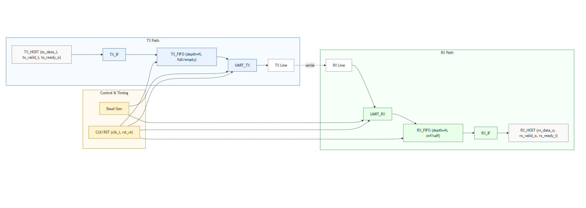
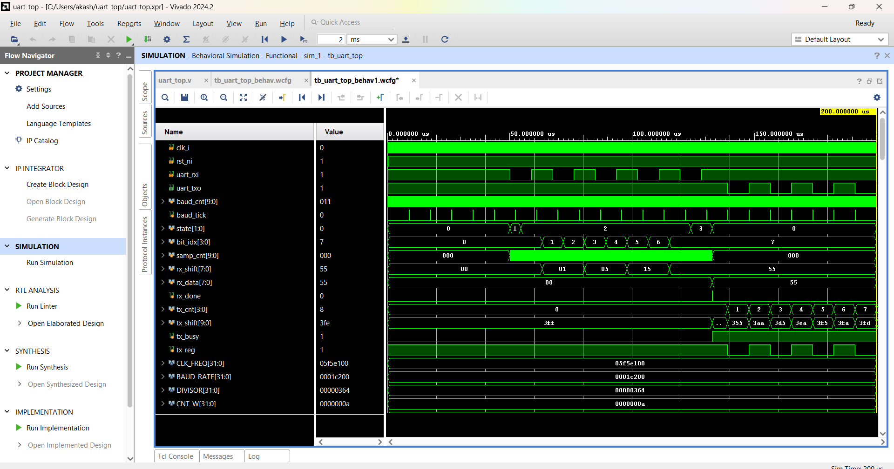
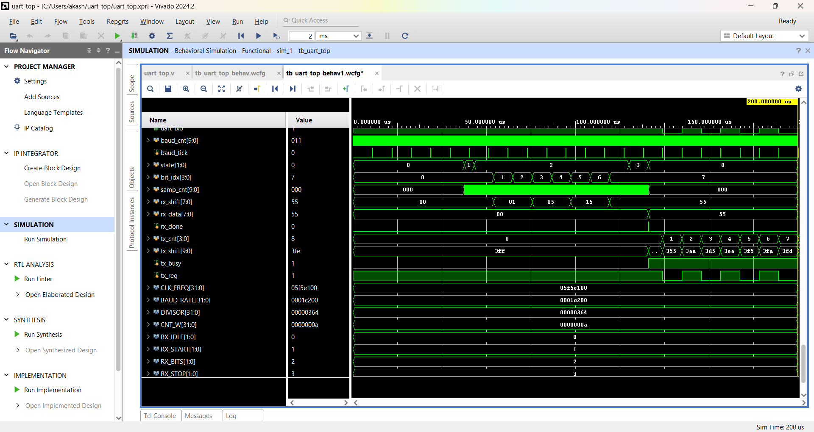
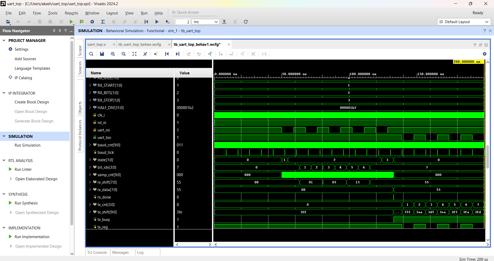

# Design-of-Enhanced-UART-System-
Configurable UART Transmitter (TX), Receiver (RX), and Baud Generator with parameterizable TX/RX FIFOs. Includes a Verilog verification environment with  constrained-random stimulus, and corner-case coverage.

⸻

📘 Overview

This project implements an Enhanced UART IP Core designed for FPGA/ASIC integration. It supports reliable data transfer through configurable FIFOs, handles corner cases like overflow/underflow, and is fully verified using modern SystemVerilog testbench practices.

The motivation was to build a reusable, robust, and parameterized UART that can be plugged into larger SoCs or FPGA designs while showcasing design + verification skills.

⸻

<h2>✨ Features</h2>
<ul>
  <li>UART Transmitter (TX) and Receiver (RX)</li>
  <li>Baud Generator with configurable divisor</li>
  <li>Parameterizable TX and RX FIFOs (synchronous)</li>
  <li>FIFO full/empty/overflow logic with flags</li>
  <li>Clean valid/ready-style streaming interface</li>
  <li>Verification Environment</li>
  <li>Verilog Testbench</li>
  <li>Scoreboard-based checking</li>
  <li>Constrained-random stimulus</li>
  <li>Corner-case coverage (underflow, overflow, simultaneous read/write)</li>
</ul>
 🏗️ Block Diagram

  

<h2>⚙️ Parameters</h2>
<table>
  <tr>
    <th>Parameter</th>
    <th>Default</th>
    <th>Description</th>
  </tr>
  <tr>
    <td>CLK_FREQ_HZ</td>
    <td>50e6</td>
    <td>Input clock frequency</td>
  </tr>
  <tr>
    <td>BAUD_RATE</td>
    <td>115200</td>
    <td>UART baud rate</td>
  </tr>
  <tr>
    <td>DATA_BITS</td>
    <td>8</td>
    <td>Number of data bits (7/8/9)</td>
  </tr>
  <tr>
    <td>PARITY_MODE</td>
    <td>0</td>
    <td>0 = none, 1 = even, 2 = odd</td>
  </tr>
  <tr>
    <td>STOP_BITS</td>
    <td>1</td>
    <td>Number of stop bits (1 or 2)</td>
  </tr>
  <tr>
    <td>TX_FIFO_DEPTH</td>
    <td>16</td>
    <td>TX FIFO depth</td>
  </tr>
  <tr>
    <td>RX_FIFO_DEPTH</td>
    <td>16</td>
    <td>RX FIFO depth</td>
  </tr>
</table>

<h2>🔌 Interfaces (Top Module: uart_top.sv)</h2>

<h3>Clocks & Reset</h3>
<ul>
  <li><b>clk_i</b> – Input clock</li>
  <li><b>rst_ni</b> – Active-low reset</li>
</ul>

<h3>TX Host Side</h3>
<ul>
  <li><b>tx_data_i [7:0]</b> – Data input</li>
  <li><b>tx_valid_i</b> – TX valid</li>
  <li><b>tx_ready_o</b> – TX ready</li>
  <li><b>tx_fifo_full_o</b> – TX FIFO full flag</li>
</ul>

<h3>RX Host Side</h3>
<ul>
  <li><b>rx_data_o [7:0]</b> – Data output</li>
  <li><b>rx_valid_o</b> – RX valid</li>
  <li><b>rx_ready_i</b> – RX ready</li>
  <li><b>rx_fifo_empty_o</b> – RX FIFO empty flag</li>
</ul>

<h3>UART Pins</h3>
<ul>
  <li><b>uart_txo</b> – UART TX line output</li>
  <li><b>uart_rxi</b> – UART RX line input</li>
</ul>

<h2>🧪 Verification</h2>
<ul>
  <li><b>Scoreboard</b> – Ensures TX input sequence matches RX output sequence</li>
  <li><b>Random Stimulus</b> – Stresses FIFOs and UART line with randomized data</li>
  <li><b>Corner Case Tests</b> – Includes overflow, underflow, and simultaneous read/write scenarios</li>
  <li><b>Assertions</b> – Protocol checks for FIFO read/write rules and UART frame structure</li>
  <li><b>Functional Coverage</b> – 
    <ul>
      <li>Data pattern bins (00h, FFh, alternating, random)</li>
      <li>Parity modes (none, even, odd)</li>
      <li>Stop bits (1 or 2)</li>
      <li>FIFO states (empty, full, transitions, simultaneous read/write)</li>
      <li>Error injection coverage (framing errors, parity errors)</li>
    </ul>
  </li>
</ul>

<h2>📊 Example Results</h2>
<ul>
  <li>✅ Smoke test passes with TX → RX loopback</li>
  <li>✅ FIFO overflow and underflow correctly flagged in simulation</li>
  <li>✅ Random stimulus achieves full functional coverage bins</li>
  <li>✅ UART line verified for parity and stop-bit variations</li>
</ul>

  

  

  

